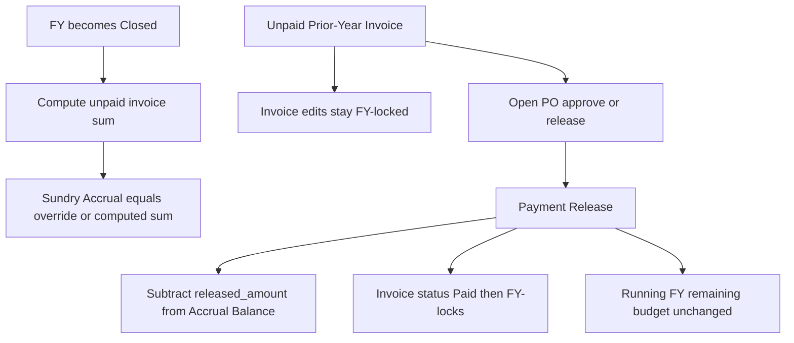

# Sundry Accruals

Feature Name: sundry-accruals
Updated: 2026-09-04

## Description

Closed fiscal years keep a Sundry Accrual equal to unpaid invoices of that year, overridable by Master Access. Payment Release on those invoices stays available without the FY-unlock password, deducts Accrual Balance, and leaves Running FY budget remaining unchanged. Admin Master Access may increase a yearly budget line. Payment Release records optional Released Via (Cheque, Bank transfer, RTGS, Other) and Release Reference.

## Architecture



Accrual math for FY `Y`:

- `unpaid` = sum of invoice `amount` (or approved amount when present) where `fiscalOf(service_to else invoice_date) = Y` and status is other than Paid
- `consumed` = sum of Cleared PO `released_amount` where the invoice belongs to `Y`
- `computed` = `unpaid + consumed`
- `secured` = Master Access override when set, otherwise `computed`
- `balance` = `secured - consumed`

Running FY remaining budget stays `yearly budget - consumed_of_running_FY`. Budget and accrual FY is the year in which service ends (`service_to`, else `invoice_date`), so closed-year payments do not hit Running FY remaining.

## Components and Interfaces

- `frontend/src/lib/accrual.ts`: pure helpers `accrualForFy`, `isUnpaidPriorYearInvoice`
- `frontend/src/lib/FyLockProvider.tsx` and `backend/src/services/fyLock.ts`: Payment Release / PO reject skip FY lock when the invoice is unpaid and closed-year
- Administration Yearly budgets: show Accrual and Accrual Balance; Master Access override field; budget save rejects increases unless Master Access is on
- Payment Orders Approve & Release: optional Released Via select and Release Reference
- `GET /api/accruals?fy=` returns `{ fy, unpaid, consumed, computed, override, secured, balance, invoices[] }`
- `PUT /api/accruals` `{ fy, override: number | null }` requires admin + Master Access session flag from the client
- `PUT /api/budgets` compares incoming line amounts to stored amounts; an increase requires Master Access; a Closed FY increase skips FY lock
- `POST /api/payment-orders/:id/approve` accepts `releasedVia`, `releaseReference`; skips FY lock for unpaid closed-year invoices

## Data Models

`app_settings` key `fy_accrual_overrides`:

```json
[{ "fy": "FY25", "amount": 1250000 }]
```

`po_versions` new columns:

- `released_via text` — `cheque` | `bank_transfer` | `rtgs` | `other` | null
- `release_reference text` — free text, null allowed

Existing DBs apply `supabase/sundry_accruals.sql`. Fresh installs get the same columns in `schema.sql`.

## Correctness Properties

- Accrual Balance plus consumed equals secured
- Payment Release on a Closed FY invoice leaves Running FY `budget - released` unchanged
- Invoice row updates for a Closed FY still require FY unlock
- PO approve/reject/release for an Unpaid Prior-Year Invoice succeed without FY unlock
- A budget line amount greater than the stored amount persists only when Master Access is unlocked
- Approve & Release succeeds when Released Via and Release Reference are empty

## Error Handling

- Budget increase without Master Access: 403 `BUDGET_INCREASE_REQUIRES_MASTER`
- Accrual override without Master Access: 403
- Invalid `releasedVia`: 400
- Accrual Balance below zero after override: persist and show a warning badge

## Test Strategy

- Unit: `accrualForFy` with unpaid, paid, override, mixed FYs
- Demo mockApi: release a FY25 unpaid invoice during FY26; Running FY remaining unchanged; Accrual Balance drops
- Demo: Closed FY invoice edit still blocked; PO release succeeds
- Demo: budget increase blocked until Master Access; then saved
- Demo: PO release with empty via/reference; then with Cheque + reference shown on list and print

## References

[^1]: (Filename) - Requirements `.monkeycode/specs/2026-09-04-sundry-accruals/requirements.md`
[^2]: (Filename) - FY lock `frontend/src/lib/FyLockProvider.tsx`
[^3]: (Filename) - PO approve `backend/src/routes/paymentOrders.ts`
[^4]: (Filename) - Budgets `backend/src/routes/master.ts`
