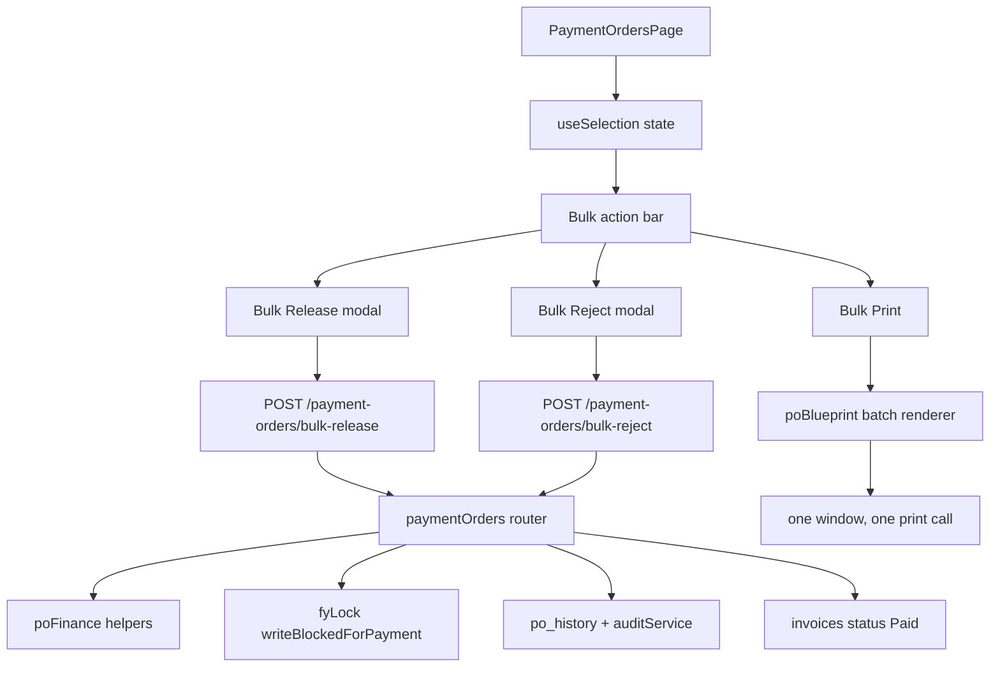

# Payment order bulk release and bulk print

Feature Name: po-bulk-release-and-print
Updated: 2026-09-17

## Description

The Payment Orders page releases and prints one payment order at a time. This feature adds a selection column to the register, a finance-only Bulk Release that clears several payment orders in one request, a finance-only Bulk Reject that returns several payment orders with one shared reason, and a Bulk Print that renders the selected payment orders into one printable document. Bulk Release records each PO's own generated amount and one shared release channel set. Bulk Print covers the selected rows only.

## Architecture

Bulk Release and Bulk Reject reuse the exact per-PO rules of the existing single actions (`backend/src/routes/paymentOrders.ts:129` and `:243`); the only new behaviour is iteration, shared input values and batch reporting. The FY lock is evaluated per PO and aborts the whole batch before any write. Bulk Print is frontend-only and extends the existing template renderer (`frontend/src/lib/poBlueprint.ts:322`).

## Components and Interfaces

### Backend — `backend/src/routes/paymentOrders.ts`

Two new authenticated routes, both finance-only:

- `POST /payment-orders/bulk-release`
  - Body: `{ ids: string[], releasedVia?: string, releaseReference?: string, remarks?: string }`
  - Response: `{ released: number, skipped: number, failed: number, skippedSerials: string[], failedSerials: string[] }`
  - Rejects an empty `ids` array with HTTP 400 and a non-finance caller with HTTP 403.
  - Iterates ids: loads the PO with `PO_SELECT`, resolves the nested invoice, and calls `writeBlockedForPayment`. A locked PO returns HTTP 403 `{ code: 'FY_LOCKED' }` and the batch stops before any further write.
  - Skips a PO whose normalized status is not `Generated`, recording its serial in `skippedSerials`.
  - For each eligible PO writes the same fields and history rows as the single route: `po_versions` set to `Cleared` with finance and release columns, `po_history` rows `FinanceApproved` and `PaymentReleased`, `audit` entry `FinanceClearPO`, then `invoices.status = 'Paid'` with `audit` entry `MarkPaid`.
  - `released_amount` is `poGeneratedAmount(po, invoice)` for that PO; the shared `releasedVia`, `releaseReference` and `remarks` are written to every released PO.
- `POST /payment-orders/bulk-reject`
  - Body: `{ ids: string[], reason: string }`
  - Response: `{ rejected: number, skipped: number, failed: number, skippedSerials: string[], failedSerials: string[] }`
  - Rejects an empty `ids` array and an empty `reason` with HTTP 400, and a non-finance caller with HTTP 403.
  - Applies the same FY lock, status and skip rules as bulk-release, then sets `Rejected`, records the shared reason in `finance_remarks`, clears the five release columns, writes the `FinanceRejected` history row and the `FinanceRejectPO` audit entry.

To keep the single and bulk routes identical, the DB-write slices move into `backend/src/services/poFinance.ts` as pure patch builders:

- `isAwaitingFinance(status): boolean` — normalized status equals `Generated`.
- `releasePatch({ email, now, releasedAmount, releasedVia, releaseReference, remarks })` — returns the `po_versions` update object.
- `rejectPatch({ email, now, reason })` — returns the `po_versions` update object with cleared release columns.
- `bulkSummary(results)` — folds per-PO outcomes into `released|rejected`, `skipped`, `failed` and the serial lists.

### Frontend — `frontend/src/pages/PaymentOrdersPage.tsx`

Selection mirrors `frontend/src/pages/InvoicesPage.tsx:357`:

- State: `selected: Set<string>`, `lastClickIdx`, `bulkBusy`, `bulkReleasing`, `bulkRejecting`.
- A leading checkbox column and a header `HeaderTh columnKey="select"`; the header checkbox selects every row in the current filtered and sorted view, row checkboxes toggle one row, and Shift-click selects the range from `lastClickIdx`.
- The action bar renders while `selected.size > 0` and shows the count plus the summed generated amount. It offers Clear, Print selected, and — for `isFinanceOfficial(user?.role)` — Release selected and Reject selected.
- Release selected opens a modal for the shared Released Via, Release Reference and Remarks; the modal states that each PO releases its own generated amount. Reject selected opens a modal for the shared reason.
- `bulkRelease()` and `bulkRejectSubmit()` POST to the new routes, then toast, emit an app event, clear the selection and reload while preserving search, filters, sort and grouping. Before posting they call `guardWrite` over the eligible invoices, matching the single-action lock check in `frontend/src/pages/PaymentOrdersPage.tsx:436`.
- `printSelected()` maps the selected rows, in sorted order, to `{ order, extras }` items using the existing `vendor`, `amount`, `logoUrl` and `costCenter` computation, then calls the batch renderer.

### Frontend — `frontend/src/lib/poBlueprint.ts`

Refactor the single-document renderer (`frontend/src/lib/poBlueprint.ts:322`) so the style block and the sheet markup are reusable:

- `poStyleHtml(config)` — the current `<style>` block, including a print rule `@media print { .batch-item { break-after: page } .batch-item:last-child { break-after: auto } }`.
- `poSheetHtml(config, ctx)` — the current `
…
`, unchanged.
- `paymentOrderBlueprintHtml(order, extras, template)` — unchanged output (one sheet).
- `paymentOrderBatchHtml(items, template)` — parse the template once, build one context per item, and emit one document containing all sheets wrapped in `
`, with a single script that calls `window.print()` one time.
- `openPaymentOrderPrintBatch(items, template): boolean` — opens one window, writes the batch document, closes the document, and returns whether the window opened. `openPaymentOrderPrint` returns the same boolean so the single-print caller can report a blocked popup (Requirement 4.6).

## Data Models

No schema change. The feature reads and writes existing columns:

- `po_versions`: `status`, `finance_approved_by`, `finance_approved_at`, `finance_remarks`, `released_amount`, `released_by`, `released_at`, `released_via`, `release_reference`.
- `po_history`: `po_id`, `invoice_id`, `action`, `actor`, `amount`, `remarks`.
- `invoices`: `status`, `updated_at`, `updated_by`.

## Correctness Properties

1. Batch atomicity on FY lock: when any selected PO is FY-locked, the batch writes no payment order, no invoice and no history row.
2. `released_amount` equals that PO's generated amount, computed by `poGeneratedAmount`.
3. Each released PO gains exactly one `FinanceApproved` history row and one `PaymentReleased` history row.
4. Each released PO's linked invoice reaches status `Paid`.
5. Each rejected PO has `released_amount`, `released_by`, `released_at`, `released_via` and `release_reference` set to null.
6. A skipped or failed PO never changes state.
7. Bulk Print emits one sheet per selected PO and calls the browser print dialog exactly one time.
8. Selection persists after Bulk Print and clears after a successful Bulk Release or Bulk Reject.

## Error Handling

- Empty `ids` → HTTP 400 `No payment orders selected`.
- Empty reject reason → HTTP 400 `Rejection reason is required`.
- Non-finance caller → HTTP 403 with the same message as the single routes.
- FY lock → HTTP 403 `{ code: 'FY_LOCKED' }` naming the fiscal year; the whole batch is abandoned.
- Per-PO database error → the PO joins `failedSerials` and the batch continues.
- Blocked print window → the page keeps the selection and shows a toast error.

## Test Strategy

- Unit tests in `backend/test/poFinance.test.ts` for `isAwaitingFinance`, `releasePatch`, `rejectPatch` and `bulkSummary`, including a rejected PO whose release columns are cleared and a mixed-status summary.
- Backend typecheck and the full `npm test` suite in `Asia/Karachi` and `UTC`.
- Frontend `tsc -p tsconfig.app.json --noEmit`, `oxlint src` and `npm run build`.
- A structural check of `paymentOrderBatchHtml` that asserts one sheet per item, page-break markers between sheets, and a single `window.print()` call.
- Manual smoke test (needs Supabase, which is not reachable in this environment): select several awaiting POs, Bulk Release, confirm statuses, Paid invoices, history and budget/accrual movement; Bulk Reject a second batch and confirm cleared release fields; Bulk Print and confirm one dialog with one page per PO.

## References

[^1]: (Filename#L129) - [Single PO approve/release route](../backend/src/routes/paymentOrders.ts)
[^2]: (Filename#L243) - [Single PO reject route](../backend/src/routes/paymentOrders.ts)
[^3]: (Filename#L357) - [Invoice selection pattern](../frontend/src/pages/InvoicesPage.tsx)
[^4]: (Filename#L310) - [Invoice bulk approve route](../backend/src/routes/invoices.ts)
[^5]: (Filename#L322) - [PO print renderer](../frontend/src/lib/poBlueprint.ts)
[^6]: (Filename#L155) - [PO payment FY lock](../backend/src/services/fyLock.ts)
