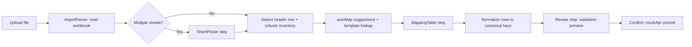

# Data Import Mapping Wizard

Feature Name: data-import-mapping
Updated: 2026-08-28

## Description

Adds a mapping layer to the Data Import module. Uploaded workbooks are parsed in the browser, their worksheets and header rows are detected, and the user maps each EOMS element to a source header through a two-column mapping table with sample-value previews and normalization checks. Confirmed mappings normalize rows client-side and hand canonical rows to the existing review/commit flow.

## Architecture



Parsing moves client-side (SheetJS `xlsx` in the browser). Rationale: the preview environment runs demo mode with an unusable backend, the file never leaves the browser, and normalization results become testable in isolation. The backend parse/confirm endpoints remain untouched as the server-side path for production.

## Components and Interfaces

### New: `frontend/src/lib/importParser.ts`

- `readWorkbook(file: File): Promise<ParsedWorkbook>` — `xlsx.read` with `cellDates: true`; CSV accepted through the same reader.
- `detectHeaderRow(rows: RawRow[], schemas): number` — scores the first ten rows by text density plus alias hits; returns row index (0-based).
- `buildColumns(rows, headerRowIdx): SourceColumn[]` — emits `{ letter, header, hidden, key, samples }`; duplicate headers get `_2` suffixes; hidden state from the sheet's `!cols`.

```ts
interface ParsedWorkbook {
  sheets: Array<{ name: string; rowCount: number; rows: Record<string, unknown>[]; hiddenCols: string[] }>
}
interface SourceColumn { key: string; letter: string; header: string; hidden: boolean; samples: unknown[] }
```

### New: `frontend/src/lib/importMapping.ts`

- `IMPORT_SCHEMAS: Record<ImportType, ElementDef[]>` — per type: `{ key, label, type: 'text'|'number'|'date', required, aliases[] }`. Invoice schema covers invoice_no, invoice_date, processing_date, amount, contract_no, t1-t3, tanker_name; contracts covers contract_no, vendor, service, start/end date, value; vendors covers name, email.
- `autoMap(columns, schema): MappingState` — normalize header text (lowercase, strip non-alphanumerics), exact alias match first, then token-overlap score; returns `{ elementKey -> { columnKey, confidence: 'high'|'low' } }` with one-header-one-element contention resolution by score.
- `normalizeValue(type, raw): { value: unknown; warning?: string }` — dates: JS Date from cellDates, else `YYYY-MM-DD` / `DD/MM/YYYY` (day-first default, ambiguity warning) / Excel serial number; amounts: strip currency symbols/spaces/commas, parenthesized negatives, reject decimal-comma ambiguity; text: trim.
- `signatureOf(columns): string` — normalized headers joined, used as template key.
- Template store: `loadTemplate(type, signature)` / `saveTemplate` on `localStorage['prl-eoms-import-tpl-{type}']`.

### New: `frontend/src/components/ui/MappingTable.tsx`

Two-column table. Left: element label + Required badge + type badge + confidence/warning badges. Right: portaled popover selector (same `createPortal` + fixed positioning pattern as ColumnsButton) listing every source column with samples and an explicit Ignore entry; below the selector, raw sample values and their normalized forms.

### Rework: `frontend/src/pages/ImportPage.tsx`

Wizard becomes: 1 Upload → 2 Sheets (shown only when multiple) → 3 Map → 4 Review → 5 Confirm. Map step blocks Continue while any required element is unmapped and highlights them. Template auto-apply keeps the user on the Map step with an applied-template notice. Review consumes canonical rows produced from the confirmed mapping.

### Change: `frontend/src/lib/mockApi.ts`

`/api/import/confirm` accepts rows already keyed by canonical schema keys (the client mapped and normalized them); `importPreview` fake is retired from the upload path. Demo commit reuses the existing `confirmImport` canonical branch.

## Data Models

```ts
type MappingState = Record<string, { columnKey: string | null; confidence: 'high'|'low'|'manual' }>
interface CanonicalRow { data: Record<string, string | number | null>; errors: string[] }
```

## Correctness Properties

1. A source column maps to at most one element at any time.
2. Continue from the Map step requires every `required` element to have a column assignment.
3. Every canonical row value passes `normalizeValue` or the row carries the failure in `errors`.
4. A stored template applies only when the normalized header signature equals the stored signature.
5. Hidden columns appear in the inventory and are usable, but carry a visible hidden marker.

## Error Handling

| Scenario | Behavior |
|---|---|
| Password-protected or corrupt workbook | Toast error naming the file; stay on Upload step |
| Workbook with zero readable rows | Error on the Sheets step, no mapping offered |
| No alias hits on any row | Header row defaults to row 1 with a manual-row control visible |
| Sample normalization failures | Inline warning badge on the element; Review lists affected rows |
| Duplicate header texts | Suffix `_2`, flagged in the column inventory |

## Test Strategy

- Pure-function checks via a scratch node script: `normalizeValue` across date formats (ISO, DD/MM/YYYY, Excel serial, ambiguous), amounts (commas, Rs prefix, parentheses), and `autoMap` alias/fuzzy/contiction cases.
- Manual wizard passes with three fixture files: clean headers, banner-plus-shifted headers with multiple sheets, and messy headers with duplicates/hidden columns.
- Regression: `npx tsc -b`, `npm run build`, `npm run lint`, HMR log check.

## References

[^1]: (Filename#L4) - `backend/src/services/parseExcel.ts` current fixed-first-sheet parsing
[^2]: (Filename#L37) - `backend/src/services/importService.ts` alias matcher being replaced client-side
